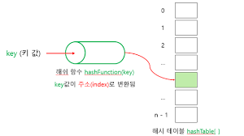

# #️⃣해싱
**1. 해싱이란❓**  
**2. 해시함수**  
**3. 사용의의와 개선점**

---
## 해싱이란❓  

- 해시함수를 사용하고 인풋은 **평문** 아웃풋은 **암호문**으로 이루어진 것  

구조로는 key, 해시함수, 해시 테이블  
key가 해시함수로 들어가게 되면 나오는 해시 테이블 구조로 되어있다.
## 해시함수

  

해시 함수는 단반향함수로 역으로 해시함수의 입력값을 바꿀 수 없는 구조로 되어었다. 해시함수는 어떠한 수학식으로 되어있는데 그 구조에 key값이 들어가면 일정한 값의 해시 테이블이 나오는 형식이다.  

예를 들어 a라는 값을 해시 함수안에 넣었다면 해시 테이블을 a의 대한 해시 테이블이 고정적으로 나오게 되는 것이다.  
즉 난수가 아닌 어떠한 함수식의 계산으로 인한 출력값 도출이다.  

예를 들어 어떠한 a유저가 pw라는 비밀번호를 사용하고,  
b유저도 pw라는 비밀번호를 사용한다면  
두 유저의 해시 테이블은 같은 값을 가지게 된다.

## 사용의의와 개선점
민감한 정보나 개인 비밀번호 등의 암호화를 설정할 때 사용한다는 의미에서  
보안성을 높이는데에 의의를 둘 수 있다.  
다만 해시 함수 특성 상 수학적인 요소로 만든 함수이므로  
암호값을 알게되면 key값을 유추할 수 있다는 단점이 있다.  

이를 보완한 것이 salt(소금) 솔트해싱이다.  
해싱은 사용자의 값이 중복되면 같은 값이 나온다는 단점이 있었다.(충돌)  
하지만 솔트해싱은 유저마다 값을 다르게 해줄 수 있어 충돌을 방지할 수 있다.  
또한 해시를 통한 해킹 공격을 어렵게 할 수 있는 점이 있습니다.  
이를 통해 보다 정보를 더 안전하게 지킬 수 있습니다.
